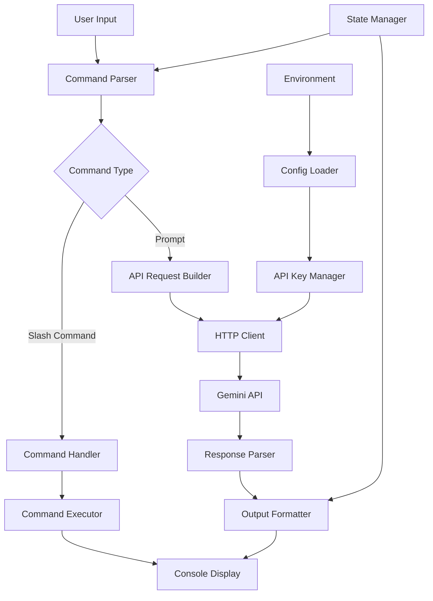
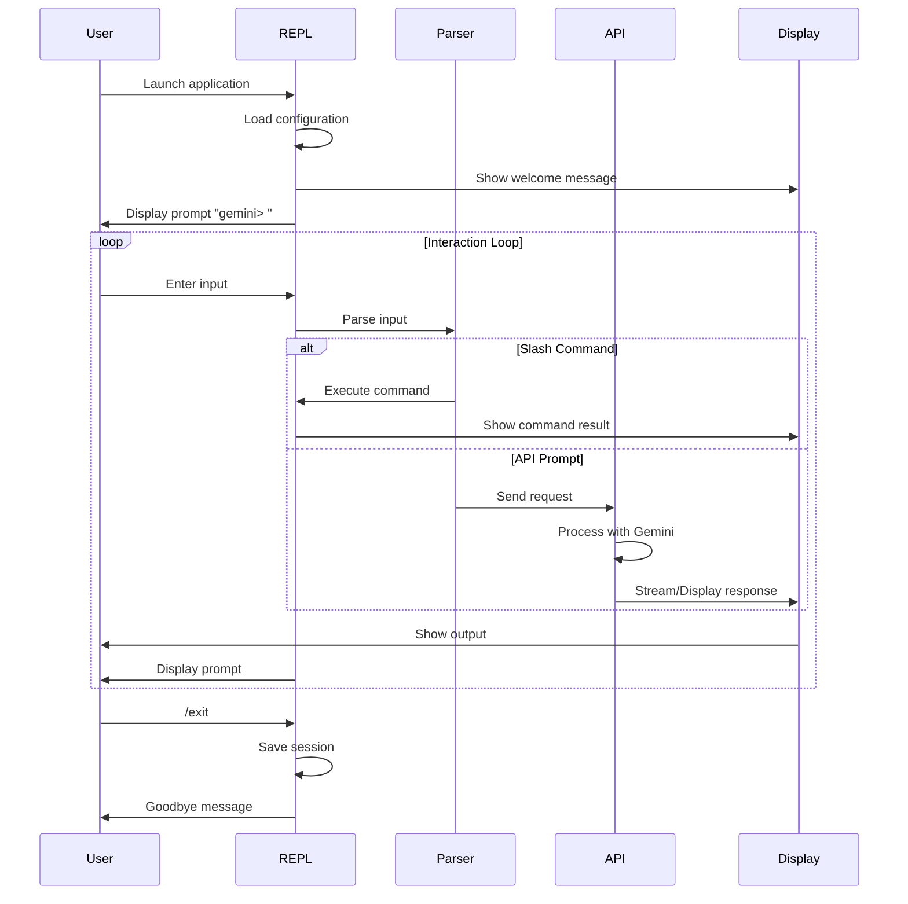

# Gemini API REPL System Requirements

## Overview

A lightweight, interactive console application that provides a REPL interface to the Google Gemini API, allowing users to send prompts and receive AI-generated responses in a conversational format.

## System Architecture



## Core Components

### 1. Input Handler
- **Purpose**: Capture and process user input from the console
- **Responsibilities**:
  - Read line-by-line input
  - Trim and validate input
  - Route to appropriate handler

### 2. Command Parser
- **Purpose**: Distinguish between slash commands and prompts
- **Command Format**: All commands begin with `/`
- **Parsing Rules**:
  - Commands: `/command [arguments]`
  - Prompts: Any non-slash-prefixed input

### 3. Command System

#### Core Commands
- `/help` - Display available commands and usage
- `/exit` or `/quit` - Terminate the REPL session
- `/clear` - Clear the console screen
- `/history` - Show command/prompt history
- `/save <filename>` - Save conversation to file
- `/load <filename>` - Load and replay a conversation
- `/model <model-name>` - Switch Gemini model
- `/config` - Display current configuration
- `/retry` - Retry the last prompt

#### Advanced Commands
- `/system <message>` - Set system context
- `/temperature <value>` - Adjust response randomness (0.0-1.0)
- `/max-tokens <value>` - Set maximum response length
- `/stream` - Toggle streaming responses
- `/debug` - Toggle debug mode for API calls

### 4. API Client
- **Purpose**: Handle all communication with Gemini API
- **Features**:
  - Configurable base URL and model endpoint
  - Request construction with proper headers
  - Error handling and retry logic
  - Response streaming support

### 5. Configuration Manager
- **Sources** (in priority order):
  1. Environment variables
  2. Configuration file (`~/.gemini-repl/config`)
  3. Command-line arguments
  4. Default values

- **Key Configurations**:
  - `GEMINI_API_KEY` - API authentication
  - `GEMINI_MODEL` - Default model (gemini-2.0-flash)
  - `GEMINI_TEMPERATURE` - Response creativity
  - `GEMINI_MAX_TOKENS` - Response length limit

### 6. State Manager
- **Purpose**: Maintain conversation context
- **State Elements**:
  - Conversation history
  - Current model settings
  - User preferences
  - Session metadata

### 7. Output Formatter
- **Purpose**: Present responses in a readable format
- **Features**:
  - Syntax highlighting for code blocks
  - Markdown rendering support
  - Progress indicators for long operations
  - Error message formatting

## User Interface Flow



## Data Structures

### Request Format
```json
{
  "contents": [{
    "parts": [{
      "text": "<user-prompt>"
    }]
  }],
  "generationConfig": {
    "temperature": <float>,
    "maxOutputTokens": <int>,
    "topK": <int>,
    "topP": <float>
  }
}
```

### Response Handling
- Parse JSON response structure
- Extract text from `candidates[0].content.parts[0].text`
- Handle error responses gracefully
- Support partial responses for streaming

## Error Handling

### Error Categories
1. **Configuration Errors**
   - Missing API key
   - Invalid configuration file
   - Unsupported model selection

2. **Network Errors**
   - Connection timeouts
   - DNS resolution failures
   - SSL certificate issues

3. **API Errors**
   - Rate limiting (429)
   - Authentication failures (401)
   - Invalid requests (400)
   - Server errors (5xx)

4. **User Input Errors**
   - Unknown commands
   - Invalid command syntax
   - Empty prompts

## Non-Functional Requirements

### Performance
- Response time < 100ms for local operations
- Streaming support for real-time response display
- Efficient memory usage for long conversations

### Usability
- Intuitive command structure
- Helpful error messages
- Command autocomplete support
- Conversation history with arrow keys

### Security
- API key never displayed in logs
- Secure storage of configuration
- No sensitive data in command history

### Extensibility
- Plugin system for custom commands
- Configurable output formatters
- Support for multiple LLM providers
- Webhook integration for responses

## Implementation Considerations

### Technology Stack
- Language: ClojureScript (as specified)
- Runtime: Node.js
- Dependencies:
  - HTTP client library
  - Readline interface
  - Configuration parser
  - Async handling

### Development Phases

1. **Phase 1: Core Functionality**
   - Basic REPL loop
   - API integration
   - Essential commands (/help, /exit)

2. **Phase 2: Enhanced Features**
   - Configuration management
   - History and persistence
   - Advanced commands

3. **Phase 3: Polish**
   - Streaming responses
   - Syntax highlighting
   - Plugin system

### Testing Strategy
- Unit tests for command parsing
- Integration tests for API client
- End-to-end tests for user workflows
- Mock API responses for offline testing
